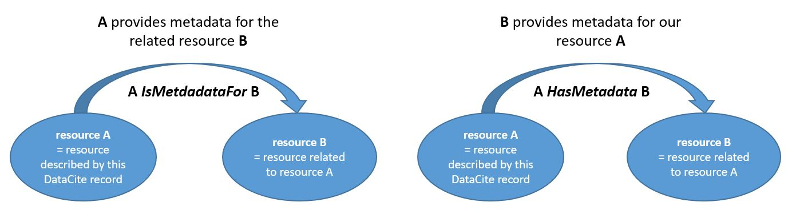

# Authors

**Christiane Bayer**, IT-Gruppe Geisteswissenschaften (LMU) \
([ORCID: 0000-0003-3074-4222](https://orcid.org/0000-0003-3074-4222), v2)\
**Andreas Frech**, Universitätsbibliothek der LMU \
([ORCID: 0000-0002-1458-1163](https://orcid.org/0000-0002-1458-1163), v2+v3+v4+v5)\
**Vanessa Gabriel**, Universitätsbibliothek der LMU \
([ORCID: 0000-0002-2058-5160](https://orcid.org/0000-0002-2058-5160), v2+v3)\
**Sonja Kümmet**, Universitätsbibliothek der LMU \
([ORCID: 0000-0002-8954-0200](https://orcid.org/0000-0002-8954-0200), v1)\
**Stephan Lücke**, IT-Gruppe Geisteswissenschaften (LMU) \
([ORCID: 0000-0002-5853-1918](https://orcid.org/0000-0002-5853-1918), v1+v2)\
**Laura Meier**, Universitätsbibliothek der LMU \
([ORCID: 0000-0003-1368-2306](https://orcid.org/0000-0003-1368-2306), v4+v5)\
**Johannes Munke**, Leibniz Supercomputing Centre \
([ORCID: 0000-0002-5031-9170](https://orcid.org/0000-0002-5031-9170), v2)\
**Markus Putnings**, Universitätsbibliothek der FAU \
([ORCID: 0000-0002-6014-9048](https://orcid.org/0000-0002-6014-9048), v2)\
**Jürgen Rohrwild**, Universitätsbibliothek der FAU \
([ORCID: 0000-0002-1167-0339](https://orcid.org/0000-0002-1167-0339), v2+v3+v4)\
**Julian Schulz**, Max Weber Stiftung - Deutsche Geisteswissenschaftliche Institute im Ausland \
([ORCID: 0000-0003-4374-2680](https://orcid.org/0000-0003-4374-2680), v1+v2)\
**Martin Spenger**, Universitätsbibliothek der LMU \
([ORCID: 0000-0002-8841-5985](https://orcid.org/0000-0002-8841-5985), v1+v2+v3+v4+v5)\
**Tobias Weber**, Leibniz Supercomputing Centre \
([ORCID: 0000-0003-1815-7041](https://orcid.org/0000-0003-1815-7041), v1)\

If you have any questions about this DataCite Best Practice Guide, please contact [forschungsdaten@ub.uni-muenchen.de](mailto:forschungsdaten@ub.uni-muenchen.de) or [ub-fdm@fau.de](mailto:ub-fdm@fau.de). 

# DataCite Best Practice Guide

The [DataCite Metadata Schema [external link]](https://schema.datacite.org) has become a de facto standard for describing research data. Although the schema aims to standardize metadata, it still allows considerable flexibility and room for interpretaion in many areas. For example, languages used in the metadata may be identified using ISO 639-1, ISO 639-2, ISO 639-2/B, or ISO 639-3 language codes. The aim of this Best Practice Guide is to reduce ambiguity by recommending preferred options where DataCite provides multiple alternatives, thereby promoting consistency across records while simplifying the metadata creation and management.

This document is a guideline for the official [DataCite Metadata Schema documentation [external link]](https://schema.datacite.org), [version 4.7 [external link]](https://doi.org/10.14454/qdd3-ps68). 
It is meant for researchers, IT and library support staff. Further information on the schema can be found on the [DataCite support site [external link]](https://support.datacite.org/docs/datacite-metadata-schema).

To create a DataCite XML file, we recommend that you use the [DataCite Metadata Generator [external link]](https://www.datacite-metadatengenerator.gwi.uni-muenchen.de/). The tool is synchronized with this guide, except for brief update intervals between versions. If you want to create metadata for research data on a scale that is too large for manual procedures, please contact one of the institutions named above.

## Overview

The first part, [general best practice](#a.-general-best-practice), presents general recommendations and requirements for using the DataCite metadata standard and is structured as a series of frequently asked questions (FAQ).

The second part, [best practice for specific fields](#b.-best-practice-for-specific-fields), gives more details for each of the 20 metadata fields of the DataCite metadata standard.

The third part, [complete DataCite examples](#c.-complete-datacite-examples), provides a comprehensive DataCite metadata example and links to further examples on the DataCite website.

### [A. General best practice](#a.-general-best-practice-1)

* [What do the metadata describe?](#what-do-the-metadata-describe)
* [What is the language of the metadata?](#what-is-the-language-of-the-metadata)
* [How should I specify an institution?](#how-should-i-specify-an-institution)
* [How should I specify a person?](#how-should-i-specify-a-person)
* [How should I handle different versions of research data?](#how-should-i-handle-different-versions-of-the-same-research-data)

### [B. Best practice for specific fields](#b.-best-practice-for-specific-fields-1)

* [1 identifier [m]](#identifier-m)
* [2 creator [m]](#creator-m)
* [3 title [m]](#title-m)
* [4 publisher [m]](#publisher-m)
* [5 publicationYear [m]](#publicationyear-m)
* [6 subject [m]*](#subject-m)
* [7 contributor [r]](#contributor-r)
* [8 date [r]](#date-r)
* [9 language [o]](#language-o)
* [10 resourceType [m]](#resourcetype-m)
* [11 alternateIdentifier [o]](#alternateidentifier-o)
* [12 relatedIdentifier [r]](#relatedidentifier-r)
* [13 size [r]*](#size-r)
* [14 format [o]](#format-o)
* [15 version [o]](#version-o)
* [16 rights [m]*](#rights-m)
* [17 description [m]*](#description-m)
* [18 geoLocation [r]](#geolocation-r)
* [19 fundingReference [o]](#fundingreference-o)
* [20 relatedItem [o]](#relateditem-o)

Mandatory fields are indicated by the tag **[m]**, recommended fields by **[r]** and optional fields by **[o]**. 
Note: This guide deviates from the [DataCite Metadata Schema 4.7 [external link]](https://doi.org/10.14454/qdd3-ps68) in the assessment of recommended and optional properties and assigns different levels of obligation to some of them. They are indicated by an * in the list above.  

These fields improve discovery, make long-term management of the datasets easier for the hosting institution and are helpful for future (re-)users of the dataset. The benefits of providing additional information outweigh the effort, as most of the information is already available to researchers like providing a short abstract in the [_description_](#description-m).

For additional, practice-oriented recommendations on the curation and quality assurance of selected DataCite metadata properties, see also the following publication:
Vierkant, P., Czerniak, A., Fischer, B. K., Genderjahn, S., Hagemann-Wilholt, S., Schrader, A., Ziedorn, F., Stathis, K.& El-Gebali, S. (2025). Praxisorientierte Leitlinien für Lieferanten von DataCite DOI-Metadaten (Version 1.0). Zenodo. [https://doi.org/10.5281/zenodo.17065201 [external link]](https://doi.org/10.5281/zenodo.17065201) (in German).


### [C. Complete DataCite examples](#c.-complete-datacite-examples-1)

## A. General best practice

### What do the metadata describe?

Unless otherwise specified, the information provided in the metadata refers to the research data (also referred to as “resource”), not to the project in which the data were created or collected.


### What is the language of the metadata?
* The default language of the metadata is English. If another language is used, the same information must additionally be specified in English.
* Where language variations are possible (e.g. title, description, affiliations), the language should be specified by _xml:lang_ attributes:
  
```xml
<title xml:lang="de">
    Bayerisches Musiker-Lexikon Online (BMLO)
</title>
<title xml:lang="en" titleType="TranslatedTitle">
    Digital Encyclopedia of Bavarian Musicians
</title>
```

* Proper nouns do not need to be translated.
* Use standardized data (e.g. controlled vocabularies) whenever possible. This might allow data aggregators to display the information in the language most suitable to the use case at hand.
* Recommendation: Use either ISO 639-1 two-letter language codes or ISO 639-2 three-letter language codes (listed on [Wikipedia [external link]](https://en.wikipedia.org/wiki/List_of_ISO_639_language_codes)). Three-letter codes are commonly used in library systems. If you use a different standard (e.g. [BCP 47 [external link]](https://en.wikipedia.org/wiki/IETF_language_tag)), apply it consistently and avoid mixing standards.

### How should I specify a person?
* A person should be identified by name, persistent identifier (PID) and affiliation.
* It is recommended to not use titles/academic degrees in names as they are subject to change.
* State the name in the order "family name, given name". For example: 
  
```xml
<creatorName nameType="Personal">Krefeld, Thomas</creatorName>
```

* Recommendation: Additionally, separate family name and given name, each in a specific subfield: 
  
```xml
<givenName>Thomas</givenName>
<familyName>Krefeld</familyName>
```

* Add a PID for persons, preferably an [ORCID-ID [external link]](https://orcid.org/) (Open Researcher and Contributor ID) or a [GND-ID (Gemeinsame Normdatei) [external link]](https://www.dnb.de/DE/Professionell/Standardisierung/GND/gnd_node.html). This will make attributions robust to changes of names or affiliations:
  * Recommendation for GND-ID entries: 
    * GND-ID entries can be conveniently searched for on [WebGND [external link]](http://gnd.eurospider.com/s), [lobid-gnd [external link]](https://lobid.org/gnd) or [GND Explorer [external link]](https://explore.gnd.network/); for further search options see the [GND website [external link]](https://gnd.network/Webs/gnd/DE/Entdecken/entdecken_node.html).
    * Only use individualized GND entries that clearly identify a person (usually by year of birth and/or profession).
    * Use the "GND-URI" (starting with "http://d-nb.info/gnd/") to link GND entries.

```xml
<!-- GND entry --> 
<nameIdentifier
    schemeURI="https://d-nb.info/gnd/"
    nameIdentifierScheme="GND">
        123778689
</nameIdentifier>
        
<!-- ORCID entry -->        
<nameIdentifier
    schemeURI="https://orcid.org/"
    nameIdentifierScheme="ORCID">
        0000-0001-9657-6052
</nameIdentifier>
```

* It is also recommended to indicate the affiliation to an institution (Note: An affiliation is an institution, not a project).
  * See: [How should I specify an institution](#how-should-i-specify-an-institution)
  * If a person has multiple affiliations:
    * It is recommended to state only one institution (the context of the resource determines the affiliation).
    * If unavoidable, multiple affiliations can be specified in the order of importance for the dataset published. 

### How should I specify an institution?
* Institutions may mainly be enterend in _affiliaton_ (with _creator_ and _contributor_) or _fundingReference_.
* Follow the policy of the institution.
* State the name of the institution as specific as possible (e.g. start with the chair/group, not with the university). If the name of the institution has changed use the name as it was at the time of creation of the resource.
* Start with the more specific organizational units first and end with the most generic unit, separated by semicolon:
  
```xml
<affiliation>
        Institut für Romanische Philologie; 
        Ludwig-Maximilians-Universität München    
</affiliation>

<affiliation
    affiliationIdentifier="https://ror.org/05591te55" 
    affiliationIdentifierScheme="ROR"
    schemeURI="https://ror.org/">
        Ludwig-Maximilians-Universität München
</affiliation>
```

* If there is no policy or multiple names in multiple languages are given, use the English name.
* If possible, use a _xml:lang_ tag to specify the language in which the name is given. 
  
```xml
<publisher xml:lang="en">Leibniz Supercomputing Centre</publisher>
<publisher xml:lang="de">Leibniz-Rechenzentrum</publisher>        
```

* Affiliations must be specified at the time the resource is created.
* Add a persistent identifier (PID) for the institution, preferably a [ROR-ID [external link]](https://ror.org/) (Research Organization Registry); if there is no entry in ROR, use a [ISNI-ID [external link]](http://www.isni.org/search) (International Standard Name Identifier) or [GND-ID [external link]](https://explore.gnd.network/). (Note: Use the "GND-URI" starting with "http://d-nb.info/gnd/" to link GND entries.)
* For research funding organizations (see [_fundingReference_](#fundingreference-o)) it is recommended to additionally provide the [CrossRef Funder Registry ID [external link]](https://www.crossref.org/services/funder-registry/).

```xml
<fundingReference>
    <funderName>Deutsche Forschungsgemeinschaft (DFG)</funderName>
    <funderIdentifier
        funderIdentifierType="Crossref Funder ID">
            http://dx.doi.org/10.13039/501100001659
    </funderIdentifier>
</fundingReference>
```

### How should I handle different versions of the same research data?

Metadata can be updated without releasing a new version of the research data. However, if the research data change, the metadata must be updated accordingly.


If you want to publish several versions of the research data, but also want to have a point of reference for all of these publications together, we recommend to use a form of [DOI-versioning [external link]](https://zenodo.org/help/versioning):

* Specify a set of metadata that is valid for all versions.
* Specify a set of metadata for each version.
* Update all these metadata with the according references (e.g. include "isNewVersionOf" in the metadata of the new version, see [_relatedIdentifier_](#relatedidentifier-r) for details).

## B. Best practice for specific fields

### 1 identifier [m]
[DataCite documentation [external link]](https://datacite-metadata-schema.readthedocs.io/en/4.7/properties/identifier/)

* This field can be omitted on submission: it is mandatory according to the DataCite standard, but it will be set by the data publisher.
* The assigned [Digital Object Identifier (DOI) [external link]](https://www.doi.org/) will be provided to you by the data publisher.


__Example__
```xml
<identifier identifierType="DOI">10.5282/ubm/data.158</identifier>             
```

### 2 creator [m]
[DataCite documentation [external link]](https://datacite-metadata-schema.readthedocs.io/en/4.7/properties/creator/)

* This field is mandatory.
* Consult sections on [how to specify a person](#how-should-i-specify-a-person) and [how to specify an institution](#how-should-i-specify-an-institution).
* Always prefer natural persons over institutions.
* You can use the *xml:lang* attribute to provide the language of the *creatorName*. This may be helpful, if an institution uses different names in different languages.

__Example__
```xml
<creators>
    <creator>
        <creatorName nameType="Personal">Krefeld, Thomas</creatorName>
        <givenName>Thomas</givenName>
        <familyName>Krefeld</familyName>
         <nameIdentifier
            schemeURI="https://orcid.org/"
            nameIdentifierScheme="ORCID">
                0000-0001-9657-6052
        </nameIdentifier>
        <nameIdentifier
            schemeURI="https://d-nb.info/gnd/"
            nameIdentifierScheme="GND">
                123778689
        </nameIdentifier>
        <affiliation>
            Institut für Romanische Philologie,
            Ludwig-Maximilians-Universität München
        </affiliation>
    </creator>
</creators>
```

### 3 title [m]
[DataCite documentation [external link]](https://datacite-metadata-schema.readthedocs.io/en/4.7/properties/title/)

* This field is mandatory.
* Be as specific as you would be in the context of a journal publication.
* It is recommended to avoid filenames (e.g. "survey.csv") or generic descriptions (e.g. "survey data") as a title.
* The main title is specified without a _titleType_.
* The language of every title must be specified (see section on [metadata language](#what-is-the-language-of-the-metadata) for the use of _xml:lang_ attribute). 
* If the main title is not specified in English, a title of type "TranslatedTitle" must be given in English.
* Title types "AlternativeTitle" and "Subtitle" are supported but not recommended. "Other" must not be used as a title type.

__Example__
```xml
<titles>
    <title xml:lang="de">
            Bayerisches Musiker-Lexikon Online (BMLO)
    </title>
    <title
        xml:lang="en"
        titleType="TranslatedTitle">
            Digital Encyclopedia of Bavarian Musicians
    </title>
</titles>
```


### 4 publisher [m]
[DataCite documentation [external link]](https://datacite-metadata-schema.readthedocs.io/en/4.7/properties/publisher/)

* This field is mandatory.
* The language of the publisher name must be specified (see section on [metadata language](#what-is-the-language-of-the-metadata) for the use of _xml:lang_ attribute).
* If possible, the attibutes _publisherIdentifier_, _publisherIdentifierScheme_ and _schemeURI_ should be used. Consult sections on [how to specify an institution](#how-should-i-specify-an-institution).
* This field can be omitted on submission: it is mandatory according to the DataCite standard, but it will be set by the data publisher, i.e. the institution that hosts the (meta)data.


__Example__
```xml
<publisher
    xml:lang="de" publisherIdentifier="https://ror.org/05591te55" 
    publisherIdentifierScheme="ROR" schemeURI="https://ror.org/">
        Universitätsbibliothek der Ludwig-Maximilians-Universität München
</publisher>
```

### 5 publicationYear [m]
[DataCite documentation [external link]](https://datacite-metadata-schema.readthedocs.io/en/4.7/properties/publicationyear/)

* This field is mandatory.
* This field can be omitted on submission: it is mandatory according to the DataCite standard, but it will be set by the data publisher.

__Example__
```xml
<publicationYear>2019</publicationYear>
```

### 6 subject [m]
[DataCite documentation [external link]](https://datacite-metadata-schema.readthedocs.io/en/4.7/properties/subject/)

* This field is mandatory, in the DataCite standard it is only recommended.

#### Mandatory subject annotations
* The following subject annotations are mandatory (must occur at least once):

|Type of Subject | Standard                | Type of standard          | Usage hint |
|----------------|-------------------------|---------------------------|----------------------------------------------------------------|
|Discipline      | DDC                     | Classification            | Use the English term for the discipline and include the three digit DDC notation via the _classificationCode_ attribute ([Canonical Source [external link]](https://www.oclc.org/content/dam/oclc/dewey/resources/summaries/deweysummaries.pdf)). |
| | | | |
|Keywords        | Wikidata QID and GND  | Keyword                   | Wikidata and GND terms are both mandatory, including redundancy (if an appropriate entry does not exist contact the responsible Institution). Use [Wikidata-Search [external link]](https://www.wikidata.org) and [GND Explorer [external link]](https://explore.gnd.network/) to find the appropriate identifiers. (Note: Use the "GND-URI" starting with "http://d-nb.info/gnd/" to link GND terms.)

* It is also mandatory to include at least the _valueURI_ or the _classificationCode_ attribute. 
* It is recommended to inculde a *xml:lang* attribute for the *subject*.
* To improve machine-readability we recommend using **both** _valueURI_ and _classificationCode_. 

__Example__
```xml
<subjects>
<!-- discipline specification using Dewey Decimal Classification (DDC) -->  
    <subject 
        xml:lang="en"
        subjectScheme="DDC" 
        classificationCode="521">
            Celestial mechanics
    </subject>
<!-- keywords -->   
    <subject 
        xml:lang="en"
        subjectScheme="Wikidata" 
        schemeURI="https://www.wikidata.org/wiki/" 
        valueURI="https://www.wikidata.org/wiki/Q223776" 
        classificationCode="Q223776">
            gravity assist 
    </subject>
    <subject 
        xml:lang="en"
        subjectScheme="GND" 
        schemeURI="https://d-nb.info/gnd/" 
        valueURI="https://d-nb.info/gnd/4143246-0" 
        classificationCode="4143246-0">
            Astrodynamik
    </subject>
</subjects>
```
There should be no overlap between the discipline specifier(s) and the keywords.

#### Geotagging
Specifying the location via subject is mandatory, if applicable to the resource:

* Canonical source for geonames is the [GeoNames Service [external link]](http://www.geonames.org/export/web-services.html) (a registration for API access is necessary).
* See [_geoLocation_](#geolocation-r) for a more detailed specification.

#### Additional subject annotations
* Additional subjects may be added.
* Specify the language of the subject.
* It is recommended to always qualify subjects by URL or scheme name. A good starting point to research existing schemes is [BARTOC.org [external link]](http://www.bartoc.org/) - Basic Register of Thesauri, Ontologies & Classifications. Unqualified subjects (not controlled by a controlled vocabulary, ontology or any other standard for the subject terms) are often useless for research data aggregators due to ambiguities.


__Example__

```xml
<subjects>
<!-- mandatory-->
    <subject 
        xml:lang="en"
        subjectScheme="DDC"
        classificationCode="410">   
            Linguistics
    </subject>
    <subject 
        xml:lang="en"
        subjectScheme="DDC"    
        classificationCode="004">
            Data processing computer science
    </subject>
    <subject
        xml:lang="de"
        subjectScheme="GND"        
        schemeURI="https://d-nb.info/gnd/"
        valueURI="https://d-nb.info/gnd/4740815-7"
        classificationCode ="4740815-7">
            Chalet
    </subject>
    <subject
        xml:lang="en"
        subjectScheme="Wikidata"        
        schemeURI="https://www.wikidata.org/wiki/"
        valueURI="https://www.wikidata.org/wiki/Q136689"
        classificationCode="Q136689">
            chalet
    </subject>
    <subject
        xml:lang="fr"
        subjectScheme="Wikidata"        
        schemeURI="https://www.wikidata.org/wiki/"
        valueURI="https://www.wikidata.org/wiki/Lexeme:L643765"
        classificationCode="L643765">
            chalet
    </subject>
    <!-- optional-->
    <subject
        xml:lang="en"
        subjectScheme="Glottocode"        
        schemeURI="https://glottolog.org/resource/languoid/id/"
        valueURI="https://glottolog.org/resource/languoid/id/high1286"
        classificationCode="high1286">
            High German
    </subject>
    <subject
        xml:lang="de"
        subjectScheme="geonames"        
        schemeURI="http://www.geonames.org/"
        valueURI="http://www.geonames.org/2764958"
        classificationCode="2764958">
            Hall in Tirol
    </subject>
</subjects>
```

### 7 contributor [r]
[DataCite documentation [external link]](https://datacite-metadata-schema.readthedocs.io/en/4.7/properties/contributor/)

* This field is recommended if the data are published with a free license.
* If the license specified via the [_rights_](#rights-m) field restricts the usage in a way that possibly necessitates interaction with the rights holder, a _contributor_ of type "RightsHolder" must be specified. Examples of free licenses are CC0 1.0, CC BY 4.0, or CC BY-SA 4.0; non-free licenses are for example CC BY-NC 4.0, CC BY-NC-ND 4.0, CC BY-NC-SA 4.0 or CC BY-ND 4.0.
* Consult the sections on [how to specify a person](#how-should-i-specify-a-person) and [how to specify an institution](#how-should-i-specify-an-institution).
* If contributors change over versions, the version metadata should only include the contributors of the updated version. A metadata set representing all versions of the dataset (including links to the versions) can include all contributors with the dates of participation, see [how to handle different versions of the research data](#how-should-i-handle-different-versions-of-the-same-research-data).
* Duplicate mentions between _creator_ and _contributor_ are unproblematic.
* If a person has multiple roles, it is recommended to identify the most important role of that person and select only one.
* Be as specific as possible (a "ProjectLeader" is also considered to be a "ProjectMember", but "ProjectLeader" carries more information). Use generic role descriptions only when nothing else fits.
* If suitable use the *xml:lang* attribute to indicate the language of the *contributorName*. 
* The following roles are recommended:

|Option            | Description from DataCite standard (*italics*) and usage hints |
|-------------------|----------------------------------------------------------------------------|
|ContactPerson     | *Person with knowledge of how to access, troubleshoot, or otherwise field issues related to the resource.*|
| | |
|DataCollector     | *Person/institution responsible for finding, gathering/collecting data under the guidelines of the author(s) or Principal Investigator (PI).*|
| | |
|DataCurator       | *Person tasked with reviewing, enhancing, cleaning, or standardizing metadata and the associated data submitted for storage, use, and maintenance within a data centre or repository.*|
| | |
|DataManager       | Person or organization responsible for digital maintainance of the finished resource, e.g. migration to new hardware, software and security updates for servers, access rights management.|
| | |
|Distributor       | Institution responsible for dissemination of electronic or printed copies of the resource. The distributor is not neccessarily also a hosting institution of a digital resource, e.g., if server hosting is outsourced but the distributor still organizes access to the resource.|
| | |
|Editor       | *A person who oversees the details related to the publication format of the resource.*|
| | |
|HostingInstitution| *Typically, the organisation allowing the resource to be available on the internet through the provision of its hardware/software/operating support.*|
| | |
|ProjectLeader     | *Person officially designated as head of project team or sub-project team instrumental in the work necessary to development of the resource.*|
| | |
|ProjectManager    | *Person officially designated as manager of a project. Project may consist of one or many project teams and sub-teams.*|
| | |
|ProjectMember     | *Person on the membership list of a designated project/project team.* All persons with a contract in the context of the project which produced the resource.|
| | |
|Researcher        | *A person involved in analyzing data or the results of an experiment or formal study. May indicate an intern or assistant to one of the authors who helped with research but who was not so “key” as to be listed as an author.*|
| | |
|ResearchGroup        | *Typically refers to a group of individuals within a lab, department or division that has a specifically defined focus of activity.*|
| | |
|RightsHolder      | *Person or institution owning or managing property rights, including intellectual property rights over the resource.* Mandatory for non-free licenses; person or institution that owns the rights listed in field [_rights_](#rights-m). |
| | |
|Sponsor      | *Person or organisation that issued a contract or under the auspices of which a work has been written, printed, published, developed, etc.*|
| | |
|Supervisor      | *Designated administrator over one or more groups/teams working to produce a resource, or over one or more steps of a development process.* We recommmed using this role for PhD advisors of the creators, who did not particiate as creators or in other roles themselves.|
| | |
|Translator      | *A person, organization, or automated system responsible for converting the content of a resource from one language into another, preserving its meaning and intended message.*|
| | |
|WorkPackageLeader | *The Work Package Leader is responsible for ensuring the comprehensive contents, versioning, and availability of the Work Package during the development of the resource.*|

__Example__
```xml
<contributors>
    <contributor contributorType="ProjectLeader">
        <contributorName nameType="Personal">Ludwig, Ralf</contributorName>
        <givenName>Ralf</givenName>
        <familyName>Ludwig</familyName>
        <nameIdentifier
            nameIdentifierScheme="ORCID"
            schemeURI="https://orcid.org/">
                0000-0002-4225-4098
        </nameIdentifier>
        <affiliation>
            Department für Geographie, 
            Ludwig-Maximilians-Universität München
        </affiliation>
    </contributor>
    <contributor contributorType="RightsHolder">
        <contributorName nameType="Personal">
            Štědronská, Markéta
        </contributorName>
        <givenName>Markéta</givenName>
        <familyName>Štědronská</familyName>
        <nameIdentifier
            nameIdentifierScheme="GND"
            schemeURI="https://d-nb.info/gnd/">
                141321350
        </nameIdentifier>
        <affiliation>
            Institut für Musikwissenschaft, Universität Wien
        </affiliation>
    </contributor>
</contributors>
```

### 8 date [r]
[DataCite documentation [external link]](https://datacite-metadata-schema.readthedocs.io/en/4.7/properties/date/)

* This field is recommended.
* It is recommended to provide date and time according to the [W3C time and data formats [external link]](https://www.w3.org/TR/NOTE-datetime). If the time is specified always include the time zone.   
* Time periods can be specified by providing the start date and the end date separated by a slash (/).
* The following types should be filled-out by the data producer:
    * **Collected**: time range when the resource was arranged (not necessarily identical to the time range when the resource was created).
    * **Coverage**: date range that the resource content applies to or covers. (Example: A text corpus of newspaper articles about a historic event will *cover* a time span (associated with the event). The corpus can be *collected* over a different time span.)
    * **Created**: first version of a resource; must not be identical with updated.
    * **Updated**: for a more recent version of the resource; must not be identical with created.
    * **Valid**: date or date range during which the resource is considered accurate. (Example: A dataset containing a land use classification that is valid for the year 2025 can specify 2025-01-01/2025-12-31 as the valid date range.)
* The following types are set by the publisher:
    * **Submitted**: point in time when the data were recieved by the data publisher.
    * **Accepted**: point in time when the data publisher accepts the data for publication.
    * **Issued**: long format of the field [_publicationYear_](#publicationyear-m), point in time when a publisher publishes the data; should be set.
    * **Available**: only use in the context of embargo periods (this is not recommended).
    * **Withdrawn**: point in time when the publisher retracts the data publication.
* It is recommended to use the free text attribute _dateInformation_ for disambiguation, if multiple dates with the same type are specified.
* **Copyrighted** as a _dateType_ should not be used.

__Example__ 
```xml
<dates>
    <date 
      dateType="Created"
      dateInformation="First field campaign">
        2016
    </date>
    <date 
      dateType="Created"
      dateInformation="Second field campaign">
        2021
    </date>
    <date 
      dateType="Coverage">
        2050-09-01T00:00:00+01:00/2050-09-30T23:59:59+01:00
    </date>
</dates>
```

### 9 language [o]
[DataCite documentation [external link]](https://datacite-metadata-schema.readthedocs.io/en/4.7/properties/language/)

* This field is optional.
* The field describes the main language of the **resource**, not of the metadata.
* Recommendation: use either the two-letter language codes from ISO 639-1 or the three-letter language codes from ISO 639-2 (listed on [Wikipedia [external link]](https://en.wikipedia.org/wiki/List_of_ISO_639_language_codes)). Be advised: the three-letter codes are used in library systems.

__Example__
```xml
<language>en</language>
```

### 10 resourceType [m]
[DataCite documentation [external link]](https://datacite-metadata-schema.readthedocs.io/en/4.7/properties/resourcetype/)

* This field is mandatory.
* DateCite allows various resource types. 
* There are three goups of resources described by the metadata: Objects and instruments, discursive text, and research data.

Decision tree to pick the right _resourceTypeGeneral_:

1. If you describe a physical object (biological sample, fragment of a meteorite) or an instrument (a book scanner, a microscope) use "PhysicalObject" and "Instrument", respectively. If not, proceed with 2.

2. Decide if the resource is data or discursive text (e.g. journal article or analytical text). If it is discursive text, choose one of the following:

    * "Book"
    * "BookChapter"
    * "ConferencePaper"
    * "ConferenceProceeding"
    * "DataPaper"
    * "Dissertation"
    * "Journal"
    * "JournalArticle"
    * "OutputManagementPlan" [Note: A data management plan is a special form of output management plan]
    * "PeerReview"
    * "Poster"
    * "Preprint"
    * "Presentation"
    * "Report"
    * "Standard"
    * "StudyRegistration"
  
    If not: Proceed with 3.
3. If the data submission contains heterogeneous data, consider publishing it in separate data publications or (less preferred) use "Collection". If the data are homogeneous, proceed with 4.
4. If the data are movies, images or sound files use "Audiovisual", "Image" or "Sound", respectively. If not, proceed with 5.
5. If the data are a digital, interactive representations of some real-world phenomena (e.g. trained models in the context of machine learning) use "Model". If not, proceed with 6.
6. If the data are descriptions of a workflow (e.g. in the common workflow language), use "Workflow". If not, proceed with 7.
7. If the data are an interactive resource like a virtual notebook use "ComputationalNotebook". If not, proceed with 8.
8. If the data are source code files (incl. configuration and built artefacts), use "Software". If not, proceed with 9.
9. If the data have a fixed structure (e.g. table-like), use "Dataset". If not, proceed with 10.
10. If the data are text files, use "Text". If not, proceed with 11.
11. Check if one of the following types is applicable: 
    
    * "Award" (Use this one if, for example, the resource is an entry in a Current Research Information System (CRIS) that details a Leibniz Prize awarded to a staff member.)
    * "Event" (For example, for a conference or an award ceremony.)
    * "InteractiveResource2 (This type can be used for interactive tutorials in a learning management system or for certain websites.)
    * "Project" (If, for example, a project is funded by DFG the corresponding [GEPRIS [external link]](https://gepris.dfg.de/gepris/) entry would be assigned the _resourceTypeGeneral_ "Project".)
    * "Service" (For example, if a university IT center offers access to an LLM running on its servers, this would be a "Service". Note that the LLM code itself would be "Software".)

    If not, proceed with 12.
12. Use "Other".

**Note**: Only items with the _resourceTypeGeneral_ "Dataset" will be included in the Google Dataset Search. All other types are currently not supported.

__Examples__
```xml
<resourceType resourceTypeGeneral="Dataset">
    Regional Climate Measurements
</resourceType>
```
```xml
<resourceType resourceTypeGeneral="OutputManagementPlan">
    Data Management Plan 
</resourceType>
```


### 11 alternateIdentifier [o]
[DataCite documentation [external link]](https://datacite-metadata-schema.readthedocs.io/en/4.7/properties/alternateidentifier/)

* This field is optional.
* These alternate identifiers additionally identify the resource, meaning that it can also be found via these identifiers and distinguished from other resources by this ID.
* The _alternateIdentifier_ can be a persistent, globally unique ID. However, the field may also be used for identifiers, which are only unique and specific in the context of the research project (e.g. local identifiers or workspace identifiers) but not globally. Examples for alternate identifiers are sequence numbers, time stamps or database numbers. Contrary, the global identifier in field [_identifier_](#identifier-m) **must** be a DOI. 
* The attribute _alternateIdentifierType_ must be used to specifiy the type of the identifer.

__Recommendation for _alternateIdentifierType_:__

For common global identifers, just specify the name of the identifier or its acronym. Examples of such identifiers are: ARK, arXiv, bibcode, CSTR, DOI, EAN13, EISSN, ePIC, Handle, IGSN, ISBN, ISSN, ISTC, LISSN, LSID, PMID, PURL, RAiD, RRID, SWHID, UPC, URL, URN, and w3id.

For other identifiers we recommend to first give the origin of the ID:

* project-specific identifier: an ID that has meaning inside the project that created the data.
* application-specific identifier: an ID that has meaning in the context of an application that is used to process the data.
* institution-specific identifier: an ID that has meaning in the context of the institution that provides, funded or created the data.

and then add, separated by a slash (/), the name of the identifer, if known.
This way, even if the name of the ID is relatively obscure, the broader context of the ID can still be identified.   

__Example__ 

Each VerbaAlpina dataset is assigned an [internal ID [external link]](https://doi.org/10.5282/verba-alpina?urlappend=%3Fpage_id%3D12180%26db%3Dxxx%26single%3DL91 ) (a project-specific identifier) as well as a persistent [LMU-UB ID [external link]](https://discover.ub.uni-muenchen.de/catalog/68fd5294-9077-3983-a20e-7f25c074c4c7) (in short lmUB - an institution-specific identifier) by the data repository.

```xml
<alternateIdentifiers>
	<alternateIdentifier 
        alternateIdentifierType="institution-specific identifier/lmUB">
            68fd5294-9077-3983-a20e-7f25c074c4c7
    </alternateIdentifier>
	<alternateIdentifier 
        alternateIdentifierType="project-specific identifier/VA-ID">
            L91_v8
    </alternateIdentifier>
</alternateIdentifiers>
```


### 12 relatedIdentifier [r]
[DataCite documentation [external link]](https://datacite-metadata-schema.readthedocs.io/en/4.7/properties/relatedidentifier/)

Note that DataCite provides two separate elements to establish relationships between resources: _relatedIdentifier_ and [_relatedItem_](#relateditem-o).

The *relatedIdentifier* element should be used for machine-readable identifiers (like DOI, PubMed ID or ISBN). This identifier points to additional information on the related resource. It is recommended as it facilitates automated discovery of the described resource.

The element [_relatedItem_](#relateditem-o) can be used for information on a related object that does not have an identifier (e.g. conference contributions or book series). It is also useful if an identifier exists but one wants to provide additional, more specific information on the related resource, e.g. to provide the page number, volume and title of a journal.

* This field is recommended.
* If possible, relations of the described resource should be mirrored in the metadata of the related resource. For example, make sure that a paper referencing a dataset includes the identifier of the dataset in its metadata and vice versa. This also applies to all reciprocal _relationTypes_ (e.g. "IsNewVersionOf" and "IsPreviousVersionOf").
* The _relatedIdentifierType_ must be taken from a [fixed list [external link]](https://datacite-metadata-schema.readthedocs.io/en/4.7/appendices/appendix-1/relatedIdentifierType/): ARK, arXiv, bibcode, CSTR, DOI, EAN13, EISSN, Handle, IGSN, ISBN, ISSN, ISTC, LISSN, LSID, PMID, PURL, RAiD, RRID, SWHID, UPC, URL, URN, w3id.
* The publisher may curate the list of _relatedIdentifiers_ (e.g. adding relevant related resources over time on a best effort basis).
* The relations are always specified from the perspective of the described resource (refered to as resource A in the examples). The related resource is called resource B in the examples. For detailed definitions of all relationTypes see the [DataCite schema documentation [external link]](https://datacite-metadata-schema.readthedocs.io/en/4.7/appendices/appendix-1/relationType/).
  


* Use the _relationType_ that best describes the relationship between the resources. Only use "Other" if none of the _relationTypes_ apply. You may use _relationTypeInformation_ to provide additional information about the relationship. This is particularly recommended when using the _relationType_ "Other".

::: {.landscape}

#### relationTypes

|Relation categories | Usage | relationType | Guidance / Example |
|-----------------|-------------------|-----------------------|----------------------------------------------------------------------------|
|Versions|Use to differentiate specific and unspecific versions of a resource |HasVersion (IsVersionOf); IsNewVersionOf (IsPreviousVersionOf); IsVariantFormOf (IsOriginalFormOf); IsIdenticalTo; Obsoletes (IsObsoletedBy)|Be as specific as possible. Use "IsNewVersionOf" and "IsPreviousVersionOf" if A is the predecessor or successor of B; use of "Obsolets" and "IsObsoletedBy" is recommended for standards, legal regulations, etc. If the version is unspecific use "HasVersion" and "IsVersionOf".|
| | | | |
|Hierarchy|Use to create hierarchical relationships|IsPartOf (HasPart)| "HasPart" indicates A includes the part B; "IsPart" indicates A is a portion of B. Example: A container "HasPart" a dataset.|
| | | | |
|Provenance|Use to refer to source materials (for software also see below)| HasTranslation (IsTranslationOf); IsSourceOf; IsDerivedFrom; Continues (IsContinuedBy); Collects (IsCollectedBy) |Examples: A book in English (resource A)  "IsTranslationOf" a work written in Spanish (resource B). Volume 2 of a book series (resource A) "Continues" volume 1 (resource B). A dataset (resource A) "IsSourceOf" a diagram (resource B). An Instrument (resource A), e.g. a microscope, "Collects" an image set (resource B); a PhysicalObject (resource A) "isCollectedBy" an Instrument (resource B).|
| | | | |
|Complemen-tary | Use for resources that build on or complement each other (for software also see below) |IsSourceOf; IsDerivedFrom; Continues (IsContinuedBy); IsSupplementTo (IsSupplementedBy)|Examples: Volume 2 of a book series (resource A) "Continues" volume 1 (resource B). A computer notebook (resource A) "IsSupplementTo" an article (resource B).|
| | | | |
|Bibliographic|Use to relate published texts/ material |IsPublishedIn; References (IsReferencedBy); Cites (IsCitedBy)|Examples: An article (resource A) "IsPublishedIn" an edited volume (resource B), e.g., conference proceedings. A presentation (resource A) "References" a dataset (resource B) when discussing a plot.|
| | | | |
|Additional information|Use for resources that provide further information on the described resource |Documents (IsDocumentedBy); HasMetadata (IsMetadataFor); Describes (IsDescribedBy); Reviews (IsReviewedBy)|A digtital representation of a painting (resource A) "HasMetadata" in Europeana (Resource B). An article (resource A) "isDescribedBy" a PubMed entry (resource B). |
| | | | |
|Software specific| Use to describe software specific relationships |Requires (IsRequiredBy); Compiles (IsCompiledBy)| "Requires" can be used to indicate software dependencies. A piece of code (resource A) "Requires" a software library (resource B). "Compiles" relates software code and compiler. |
:::

__Example 1 (DOI)__

The ClimEx Project "IsDescribedBy" an article in the Journal of Applied Meteorology and Climatology. The article's DOI is [10.1175/JAMC-D-18-0021.1](https://doi.org/10.1175/JAMC-D-18-0021.1). 

```xml
<relatedIdentifiers>
    <relatedIdentifier 
        relatedIdentifierType="DOI" 
        relationType="IsDescribedBy"
        resourceTypeGeneral="JournalArticle">
            10.1175/JAMC-D-18-0021.1
    </relatedIdentifier>
</relatedIdentifiers>
```

__Example 2 (PubMed)__

PubMed provides a description and additional information on an article published in the journal Nature. The article "IsDescribedBy" a PubMed entry.
```xml
<relatedIdentifiers>
    <relatedIdentifier 
		relatedIdentifierType="PMID" 
		relationType="IsDescribedBy">
			34552256
    </relatedIdentifier>
    <relatedIdentifier
        relatedIdentifierType="arXiv"
        relationType="IsNewVersionOf">
            arXiv:2107.02222
    </relatedIdentifier>
</relatedIdentifiers>
```

__Example 3 (Wikidata)__ 

Wikidata provides metadata for the BMLO project and dataset. Thus, BMLO "HasMetadata" in Wikidata under [Q-ID 47191](https://www.wikidata.org/wiki/Q47191).
```xml
<relatedIdentifiers>
    <relatedIdentifier
        relatedIdentifierType="URL" 
        relationType="HasMetadata"
        relatedMetadataScheme="Wikidata" 
        schemeURI="https://www.wikidata.org/wiki/">
            Q47191
    </relatedIdentifier>
</relatedIdentifiers>
```

__Example 4 (Pangaea)__

Pangaea publishes datasets in the field of Earth & Environmental Science. Pangaea shows the sources that were used during the creation of the research dataset, similar to a list of references. For the full DataCite metadata for this example see [DataCite Search](https://commons.datacite.org/doi.org/10.1594/pangaea.941445).
```xml
<relatedIdentifiers>
    <relatedIdentifier 
        relationType="References" 
        relatedIdentifierType="DOI">
            10.1016/0034-6667(75)90049-4
        </relatedIdentifier>  
    <relatedIdentifier 
        relationType="References" 
        relatedIdentifierType="DOI">
            10.1016/j.revpalbo.2020.104236
        </relatedIdentifier>  
    <relatedIdentifier 
        relationType="References" 
        relatedIdentifierType="DOI">
            10.1016/j.revpalbo.2019.02.004
        </relatedIdentifier>  
    <relatedIdentifier 
        relationType="References" 
        relatedIdentifierType="DOI">
            10.1080/01916122.2014.940472
        </relatedIdentifier>  
    <relatedIdentifier 
        relationType="References"
        relatedIdentifierType="DOI">
            10.1191/095968398671104653
        </relatedIdentifier>  
    <relatedIdentifier 
        relationType="References" 
        relatedIdentifierType="Handle">
            1885/144170
        </relatedIdentifier>
</relatedIdentifiers>
```
  

### 13 size [r]
[DataCite documentation [external link]](https://datacite-metadata-schema.readthedocs.io/en/4.7/properties/size/)

* This field is recommended, whereas it is optional in the DataCite standard.
* This field is repeatable. Thus, different measures for the size / volume of the dataset can be given.  
* If you make use of this field, always specify the size in Bytes (denoted by 'B' - note that a lower case 'b' stands for bit). Prefered are: kB, MB, GB, TB etc. Separate number and unit with one space. The decimal separator must be the decimal point, e.g., *7.23 GB*.
* If the data are compressed, specify the size of the compressed file/archive.
* If the data consist of several units (without using an archival software), specify their combined sizes.
* Further information on the data size (e.g. runtime of an audio file or number of images) can be given in a separate _size_ field as free text. Note that such information can also be given in the [_description_](#description-m).

__Example__
```xml
<sizes>
    <size>7.23 GB</size>
    <size>34 min (length audio file)</size>
</sizes>
```

### 14 format [o]
[DataCite documentation [external link]](https://datacite-metadata-schema.readthedocs.io/en/4.7/properties/format/)

* This field is optional.
* Use MIME type format as specified in [RFC 2646 [external link]](https://tools.ietf.org/html/rfc2046), possible values should be taken from [the IANA list of Media Types [external link]](https://www.iana.org/assignments/media-types/media-types.xhtml).

Specify in this order (skip if it does not apply):

1.  If files are compressed, append the MIME type of the compressed file to the MIME type of the uncompressed file using a "+" sign (e.g. text/xml+zip). 
2.  If files are in an archive, specify the MIME type of the archive format, for example "application/tar". This information is useful to determine in advance which software tools are needed to access the archived files. 
3.  Specify each MIME type in a separate field in alphabetical order, do not repeat MIME types.

__Example__
```xml
<formats>
    <format>application/tar+gzip</format>
    <format>application/netcdf</format>
    <format>text/plain</format>
    <format>text/csv</format>
</formats>
```

### 15 version [o]
[DataCite documentation [external link]](https://datacite-metadata-schema.readthedocs.io/en/4.7/properties/version/)

* This field is optional.
* Note that this field refers to the **version of the resource**, not the version of the metadata.
* The versioning information is set according to the policies of the data provider (data publishers do not change/use this field).
* It is recommended to use [semantic versioning [external link]](https://semver.org/). Up to three labels are supported (Major, Minor, Patch). Depending on the resource, only one or two labels might be needed.

__Example 1 (two labels - Major.Minor)__
```xml
<version>4.2</version>
```
__Example 2 (three labels - Major.Minor.Patch)__
```xml
<version>4.2.1</version>
```


### 16 rights [m]
[DataCite documentation [external link]](https://datacite-metadata-schema.readthedocs.io/en/4.7/properties/rights/)

* This field is mandatory, whereas the DataCite standard specifies it as optional.
* If applicable, *rightsURI* must be set.
* To avoid inconsistencies only assign a single license to the described dataset or the described software code.
* It is not recommended to publish both research data and software code as part of a single publication (consider two separate publications, see [*resourceType*](#resourcetype-m)).


Guidance for choosing a license:

* Recommendation: Use one of the [Creative Commons (CC) [external link]](https://creativecommons.org/) licenses for data and [Apache 2.0 license [external link]](http://www.apache.org/licenses/LICENSE-2.0) for software.
* Use the standardized short identifier list provided by [SPDX [external link]](https://spdx.org/licenses/) to specify the license in the _rightsIdentifier_ attribute.
* You should not use CC licenses with the NC or ND limitation to ensure reusability (although submissions with these limitations are accepted).
* For further license options consult [Choose a license [external link]](https://choosealicense.com/) or the [CC license helper [external link]](https://creativecommons.org/choose/).


__Example 1 (Dataset)__
```xml
<rightsList>
    <rights
        xml:lang="en-US"
        schemeURI="https://spdx.org/licenses/"
        rightsIdentifierScheme="SPDX"
        rightsIdentifier="CC0-1.0"
        rightsURI="https://creativecommons.org/publicdomain/zero/1.0/legalcode">
            Creative Commons Zero v1.0 Universal
    </rights>
</rightsList>
```

__Example 2 (Software)__
```xml
<rightsList>
    <rights
        xml:lang="en-US"
        schemeURI="https://spdx.org/licenses/"
        rightsIdentifierScheme="SPDX"
        rightsIdentifier="Apache-2.0"
        rightsURI="https://www.apache.org/licenses/LICENSE-2.0">
            Apache License 2.0
    </rights>
</rightsList>
```


### 17 description [m]
[DataCite documentation [external link]](https://datacite-metadata-schema.readthedocs.io/en/4.7/properties/description/)

* This field is mandatory, whereas the DataCite standard only recommends it: There has to be at least one entry of type "Abstract" in English.
* Always specify the used language (_xml:lang_ attribute) of each description.
* If there are descriptions in more than one language, the content may be different (no literal translation required).
* Each description has a limit of 300 words.
* Description of _descriptionType_ "Methods" is optional.
* Description of _descriptionType_ "TechnicalInfo" is optional. Additionally, data producers could consider creating a README file and link it via the [_relatedIdentifier_](#relatedidentifier-r) field.
* These types are not recommended:
    * "SeriesInformation" (If needed, information on series title, volume, issue, or page number should be provided via the [_relatedItem_](#relateditem-o) field.) 
    * "TableOfContents"
    * "Other"

__Example__
```xml
<descriptions>
    <description xml:lang="en" descriptionType="Abstract">
        The “Kritische Ausgabe der Werke von Richard Strauss”, a 
        long-term editorial project, has been under way at the  
        Institut für Musikwissenschaft of the Ludwig-Maximilians- 
        Universität Munich since 2011; it is directed by ...
    </description>
    <description xml:lang="de" descriptionType="Abstract">
        Das Langzeit-Editionsprojekt „Kritische Ausgabe der Werke von 
        Richard Strauss“ wird seit Februar 2011 unter der Leitung von 
        Prof. Dr. Hartmut Schick am Institut für Musikwissenschaft der 
        Ludwig-Maximilians-Universität München ... 
    </description>
    <description xml:lang="en" descriptionType="Methods">
        digital editing, software/application development
    </description>
</descriptions>
```


### 18 geoLocation [r]
[DataCite documentation [external link]](https://datacite-metadata-schema.readthedocs.io/en/4.7/properties/geolocation/)

* This field is recommended where applicable.
* Describes the resource itself (e.g. where an image was taken or a sensor is located), *not* the related project or institute. If no resource location applies, leave this field empty.
* _geoLocationPlace_ must be identical to corresponding GeoNames field in the [_subjects_](#subject-m), consult the [geotagging](#geotagging) subsection.
* Canonical source for coordinates is the [GeoNames Service [external link]](http://www.geonames.org/export/web-services.html).

__Examples__

* *geoLocationPlace* and *geoLocationPolygon*:
```xml
<geoLocations>
    <geoLocation>
      <geoLocationPlace>Höslwang</geoLocationPlace>
      <geoLocationPolygon>
        <polygonPoint>
          <pointLongitude>12.2860469818115</pointLongitude>
          <pointLatitude>47.9231796264648</pointLatitude>
        </polygonPoint>
        <polygonPoint>
          <pointLongitude>12.3512439727784</pointLongitude>
          <pointLatitude>47.9231796264648</pointLatitude>
        </polygonPoint>
        <polygonPoint>
          <pointLongitude>12.3512439727784</pointLongitude>
          <pointLatitude>47.9707412719727</pointLatitude>
        </polygonPoint>
        <polygonPoint>
          <pointLongitude>12.2860469818115</pointLongitude>
          <pointLatitude>47.9707412719727</pointLatitude>
        </polygonPoint>
        <polygonPoint>
          <pointLongitude>12.2860469818115</pointLongitude>
          <pointLatitude>47.9231796264648</pointLatitude>
        </polygonPoint>
      </geoLocationPolygon>
    </geoLocation>
  </geoLocations>
```

* *geoLocationPlace* and *geoLocationBox*:
```xml
<geoLocations>
    <geoLocation>
        <geoLocationPlace>Hall in Tirol</geoLocationPlace>
        <geoLocationPoint>
            <pointLongitude>11.51667</pointLongitude>
            <pointLatitude>47.28333</pointLatitude>
        </geoLocationPoint>
        <geoLocationBox>
            <westBoundLongitude>11.5272636413574</westBoundLongitude>
            <eastBoundLongitude>11.4707803726196</eastBoundLongitude>
            <southBoundLatitude>47.2697830200196</southBoundLatitude>
            <northBoundLatitude>47.2893867492676</northBoundLatitude>
        </geoLocationBox>
    </geoLocation>
</geoLocations>
```


### 19 fundingReference [o]
[DataCite documentation [external link]](https://datacite-metadata-schema.readthedocs.io/en/4.7/properties/fundingreference/)

* This field is optional.
* This is the place to add information about the project and its funding.
* _funderName_ is mandatory, if _fundingReference_ is used. For usage see: [How should I specify an institution](#how-should-i-specify-an-institution).
* Use authoritative funding databases such as [Cordis (EU) [external link]](https://cordis.europa.eu/projects/de), [GEPRIS (DFG) [external link]](https://gepris.dfg.de/gepris), [FWF (Austria) [external link]](https://www.fwf.ac.at/de/forschungsfoerderung/fwf-programme/) to identify grants. Provide a persistent URL or PID for the funding award (e.g., a GEPRIS URL or DOI) using the _awardURI_ property.
* _awardTitle_ is the name of the grant, not the funding line or funding program.


__Example__
```xml
<fundingReferences>
    <fundingReference>
        <funderName>Deutsche Forschungsgemeinschaft</funderName>
        <funderIdentifier 
            funderIdentifierType="ROR"
            schemeURI="https://ror.org/">
                https://ror.org/018mejw64
        </funderIdentifier>
        <awardNumber 
            awardURI="http://gepris.dfg.de/gepris/projekt/253900505">
                253900505
         </awardNumber> 
        <awardTitle>
            VerbaAlpina. Der alpine Kulturraum im Spiegel seiner 
            Mehrsprachigkeit
        </awardTitle>
    </fundingReference>
</fundingReferences>
```

### 20 relatedItem [o]
[DataCite documentation [external link]](https://datacite-metadata-schema.readthedocs.io/en/4.7/properties/relateditem/)

Note that DataCite provides two separate elements to establish relationships between resources: *relatedItem* and [_relatedIdentifier_](#relatedidentifier-r).

*relatedItem* complements the field [_relatedIdentifier_](#relatedidentifier-r). Only use _relatedItem_ if 

1. the related resource you want to add does not have a PID/DOI to use _relatedIdentifier_ or 
2. you want to provide addional context for a published resource (e.g. page numbers or the number of the chapter in a book), as such information can only be provided with _relatedItem_ and not with _relatedIdentifier_. 

* This field is optional.
* Information given in this field is not evaluated automatically. The information stored in _relatedItem_ is not used in the PID graph and EventData. If a _relatedItemIdentifier_ is provided, an identical _relatedIdentifier_ is strongly recommended for indexing.
* _relatedItem_ uses the same [_relationTypes_](#relationtypes) as [_relatedIdentifier_](#relatedidentifier-r).

__Example__ 

This section provides information about the journal, including its title, volume, issue, page numbers, and publisher.

```xml
<!-- Article is published in Journal "Ladinia"; 
Article = A, Journal = B -->
<relatedItems>
	<relatedItem relatedItemType="Journal" relationType="IsPublishedIn">
		<relatedItemIdentifier 
            relatedItemIdentifierType="ISSN">
                1124-1004
        </relatedItemIdentifier>
        <titles>
            <title xml:lang="it">Ladinia</title>
            <title 
                titleType="AlternativeTitle" 
                xml:lang="it">
                    Revista scientifica dl Istitut Ladin Micurá de Rü
            </title>
        </titles>
        <publicationYear>2019</publicationYear>
        <volume>43</volume>
        <issue>1</issue>
        <firstPage>139</firstPage>
        <lastPage>155</lastPage>
        <publisher>Istitut Ladin Micurá de Rü</publisher>
	</relatedItem>
</relatedItems>
```
## C. Complete DataCite examples

DataCite provides examples for all available properties. To showcase further use cases, the curated lists of [demonstration examples [external link]](https://datacite-metadata-schema.readthedocs.io/en/4.7/xml/#demonstration-examples) and [live examples [external link]](https://datacite-metadata-schema.readthedocs.io/en/4.7/xml/#live-examples) can be used as references for creating own metadata files.

Example files can also be downloaded as XML files and uploaded in the [DataCite Metadata Generator [external link]](https://www.datacite-metadatengenerator.gwi.uni-muenchen.de/) for further processing.

::: {.content-hidden when-format="pdf"}
Below is the [comprehensive DataCite metadata example [external link]](https://schema.datacite.org/meta/kernel-4.7/example/datacite-example-full-v4.xml) demonstrating all available properties. The example is taken from the [official DataCite Metadata Schema documentation [external link]](https://schema.datacite.org/meta/kernel-4.7/).

```xml
<?xml version="1.0" encoding="UTF-8"?>
<!-- Example with all properties -->
<resource xmlns:xsi="http://www.w3.org/2001/XMLSchema-instance" xmlns="http://datacite.org/schema/kernel-4" xsi:schemaLocation="http://datacite.org/schema/kernel-4 https://schema.datacite.org/meta/kernel-4/metadata.xsd">
    <identifier identifierType="DOI">10.82433/B09Z-4K37</identifier>
    <creators>
        <creator>
            <creatorName nameType="Personal">ExampleFamilyName, ExampleGivenName</creatorName>
            <givenName>ExampleGivenName</givenName>
            <familyName>ExampleFamilyName</familyName>
            <nameIdentifier nameIdentifierScheme="ORCID" schemeURI="https://orcid.org">https://orcid.org/0000-0001-5727-2427</nameIdentifier>
            <affiliation affiliationIdentifier="https://ror.org/04wxnsj81" affiliationIdentifierScheme="ROR" schemeURI="https://ror.org">ExampleAffiliation</affiliation>
        </creator>
        <creator>
            <creatorName xml:lang="en" nameType="Organizational">ExampleOrganization</creatorName>
            <nameIdentifier nameIdentifierScheme="ROR" schemeURI="https://ror.org">https://ror.org/04wxnsj81</nameIdentifier>
        </creator>
    </creators>
    <titles>
        <title xml:lang="en">Example Title</title>
        <title titleType="Subtitle" xml:lang="en">Example Subtitle</title>
        <title titleType="TranslatedTitle" xml:lang="fr">Example TranslatedTitle</title>
        <title titleType="AlternativeTitle" xml:lang="en">Example AlternativeTitle</title>
    </titles>
    <publisher xml:lang="en" publisherIdentifier="https://ror.org/04z8jg394" publisherIdentifierScheme="ROR" schemeURI="https://ror.org/">Example Publisher</publisher>
    <publicationYear>2024</publicationYear>
    <resourceType resourceTypeGeneral="Dataset">Example ResourceType</resourceType>
    <subjects>
        <subject subjectScheme="Fields of Science and Technology (FOS)" schemeURI="http://www.oecd.org/science/inno" valueURI="http://www.oecd.org/science/inno/38235147.pdf">FOS: Computer and information sciences</subject>
        <subject subjectScheme="Australian and New Zealand Standard Research Classification (ANZSRC), 2020" schemeURI="https://www.abs.gov.au/statistics/classifications/australian-and-new-zealand-standard-research-classification-anzsrc" classificationCode="461001">Digital curation and preservation</subject>
        <subject>Example Subject</subject>
    </subjects>
    <contributors>
        <contributor contributorType="ContactPerson">
            <contributorName nameType="Personal">ExampleFamilyName, ExampleGivenName</contributorName>
            <givenName>ExampleGivenName</givenName>
            <familyName>ExampleFamilyName</familyName>
            <nameIdentifier nameIdentifierScheme="ORCID" schemeURI="https://orcid.org"> https://orcid.org/0000-0001-5727-2427</nameIdentifier>
            <affiliation affiliationIdentifier="https://ror.org/04wxnsj81" affiliationIdentifierScheme="ROR" schemeURI="https://ror.org">ExampleAffiliation</affiliation>
        </contributor>
        <contributor contributorType="DataCollector">
            <contributorName nameType="Personal">ExampleFamilyName, ExampleGivenName</contributorName>
            <givenName>ExampleGivenName</givenName>
            <familyName>ExampleFamilyName</familyName>
            <nameIdentifier nameIdentifierScheme="ORCID" schemeURI="https://orcid.org"> https://orcid.org/0000-0001-5727-2427</nameIdentifier>
            <affiliation affiliationIdentifier="https://ror.org/04wxnsj81" affiliationIdentifierScheme="ROR" schemeURI="https://ror.org">ExampleAffiliation</affiliation>
        </contributor>
        <contributor contributorType="DataCurator">
            <contributorName nameType="Personal">ExampleFamilyName, ExampleGivenName</contributorName>
            <givenName>ExampleGivenName</givenName>
            <familyName>ExampleFamilyName</familyName>
            <nameIdentifier nameIdentifierScheme="ORCID" schemeURI="https://orcid.org"> https://orcid.org/0000-0001-5727-2427</nameIdentifier>
            <affiliation affiliationIdentifier="https://ror.org/04wxnsj81" affiliationIdentifierScheme="ROR" schemeURI="https://ror.org">ExampleAffiliation</affiliation>
        </contributor>
        <contributor contributorType="DataManager">
            <contributorName nameType="Personal">ExampleFamilyName, ExampleGivenName</contributorName>
            <givenName>ExampleGivenName</givenName>
            <familyName>ExampleFamilyName</familyName>
            <nameIdentifier nameIdentifierScheme="ORCID" schemeURI="https://orcid.org"> https://orcid.org/0000-0001-5727-2427</nameIdentifier>
            <affiliation affiliationIdentifier="https://ror.org/04wxnsj81" affiliationIdentifierScheme="ROR" schemeURI="https://ror.org">ExampleAffiliation</affiliation>
        </contributor>
        <contributor contributorType="Distributor">
            <contributorName nameType="Organizational">ExampleOrganization</contributorName>
            <nameIdentifier nameIdentifierScheme="ROR" schemeURI="https://ror.org"> https://ror.org/03yrm5c26</nameIdentifier>
        </contributor>
        <contributor contributorType="Editor">
            <contributorName nameType="Personal">ExampleFamilyName, ExampleGivenName</contributorName>
            <givenName>ExampleGivenName</givenName>
            <familyName>ExampleFamilyName</familyName>
            <nameIdentifier nameIdentifierScheme="ORCID" schemeURI="https://orcid.org"> https://orcid.org/0000-0001-5727-2427</nameIdentifier>
            <affiliation affiliationIdentifier="https://ror.org/04wxnsj81" affiliationIdentifierScheme="ROR" schemeURI="https://ror.org">ExampleAffiliation</affiliation>
        </contributor>
        <contributor contributorType="HostingInstitution">
            <contributorName nameType="Organizational">ExampleOrganization</contributorName>
            <nameIdentifier nameIdentifierScheme="ROR" schemeURI="https://ror.org"> https://ror.org/03yrm5c26</nameIdentifier>
        </contributor>
        <contributor contributorType="Producer">
            <contributorName nameType="Personal">ExampleFamilyName, ExampleGivenName</contributorName>
            <givenName>ExampleGivenName</givenName>
            <familyName>ExampleFamilyName</familyName>
            <nameIdentifier nameIdentifierScheme="ORCID" schemeURI="https://orcid.org"> https://orcid.org/0000-0001-5727-2427</nameIdentifier>
            <affiliation affiliationIdentifier="https://ror.org/04wxnsj81" affiliationIdentifierScheme="ROR" schemeURI="https://ror.org">ExampleAffiliation</affiliation>
        </contributor>
        <contributor contributorType="ProjectLeader">
            <contributorName nameType="Personal">ExampleFamilyName, ExampleGivenName</contributorName>
            <givenName>ExampleGivenName</givenName>
            <familyName>ExampleFamilyName</familyName>
            <nameIdentifier nameIdentifierScheme="ORCID" schemeURI="https://orcid.org"> https://orcid.org/0000-0001-5727-2427</nameIdentifier>
            <affiliation affiliationIdentifier="https://ror.org/04wxnsj81" affiliationIdentifierScheme="ROR" schemeURI="https://ror.org">ExampleAffiliation</affiliation>
        </contributor>
        <contributor contributorType="ProjectManager">
            <contributorName nameType="Personal">ExampleFamilyName, ExampleGivenName</contributorName>
            <givenName>ExampleGivenName</givenName>
            <familyName>ExampleFamilyName</familyName>
            <nameIdentifier nameIdentifierScheme="ORCID" schemeURI="https://orcid.org"> https://orcid.org/0000-0001-5727-2427</nameIdentifier>
            <affiliation affiliationIdentifier="https://ror.org/04wxnsj81" affiliationIdentifierScheme="ROR" schemeURI="https://ror.org">ExampleAffiliation</affiliation>
        </contributor>
        <contributor contributorType="ProjectMember">
            <contributorName nameType="Personal">ExampleFamilyName, ExampleGivenName</contributorName>
            <givenName>ExampleGivenName</givenName>
            <familyName>ExampleFamilyName</familyName>
            <nameIdentifier nameIdentifierScheme="ORCID" schemeURI="https://orcid.org"> https://orcid.org/0000-0001-5727-2427</nameIdentifier>
            <affiliation affiliationIdentifier="https://ror.org/04wxnsj81" affiliationIdentifierScheme="ROR" schemeURI="https://ror.org">ExampleAffiliation</affiliation>
        </contributor>
        <contributor contributorType="RegistrationAgency">
            <contributorName nameType="Organizational">DataCite</contributorName>
            <nameIdentifier nameIdentifierScheme="ROR" schemeURI="https://ror.org"> https://ror.org/04wxnsj81</nameIdentifier>
        </contributor>
        <contributor contributorType="RegistrationAuthority">
            <contributorName nameType="Organizational">International DOI Foundation</contributorName>
        </contributor>
        <contributor contributorType="RelatedPerson">
            <contributorName nameType="Personal">ExampleFamilyName, ExampleGivenName</contributorName>
            <givenName>ExampleGivenName</givenName>
            <familyName>ExampleFamilyName</familyName>
            <nameIdentifier nameIdentifierScheme="ORCID" schemeURI="https://orcid.org"> https://orcid.org/0000-0001-5727-2427</nameIdentifier>
            <affiliation affiliationIdentifier="https://ror.org/04wxnsj81" affiliationIdentifierScheme="ROR" schemeURI="https://ror.org">ExampleAffiliation</affiliation>
        </contributor>
        <contributor contributorType="Researcher">
            <contributorName nameType="Personal">ExampleFamilyName, ExampleGivenName</contributorName>
            <givenName>ExampleGivenName</givenName>
            <familyName>ExampleFamilyName</familyName>
            <nameIdentifier nameIdentifierScheme="ORCID" schemeURI="https://orcid.org"> https://orcid.org/0000-0001-5727-2427</nameIdentifier>
            <affiliation affiliationIdentifier="https://ror.org/04wxnsj81" affiliationIdentifierScheme="ROR" schemeURI="https://ror.org">ExampleAffiliation</affiliation>
        </contributor>
        <contributor contributorType="ResearchGroup">
            <contributorName>ExampleContributor</contributorName>
            <affiliation affiliationIdentifier="https://ror.org/03yrm5c26" affiliationIdentifierScheme="ROR" schemeURI="https://ror.org">ExampleOrganization</affiliation>
        </contributor>
        <contributor contributorType="RightsHolder">
            <contributorName nameType="Personal">ExampleFamilyName, ExampleGivenName</contributorName>
            <givenName>ExampleGivenName</givenName>
            <familyName>ExampleFamilyName</familyName>
            <nameIdentifier nameIdentifierScheme="ORCID" schemeURI="https://orcid.org"> https://orcid.org/0000-0001-5727-2427</nameIdentifier>
            <affiliation affiliationIdentifier="https://ror.org/04wxnsj81" affiliationIdentifierScheme="ROR" schemeURI="https://ror.org">ExampleAffiliation</affiliation>
        </contributor>
        <contributor contributorType="Sponsor">
            <contributorName>ExampleContributor</contributorName>
            <affiliation affiliationIdentifier="https://ror.org/03yrm5c26" affiliationIdentifierScheme="ROR" schemeURI="https://ror.org"> https://ror.org/03yrm5c26</affiliation>
        </contributor>
        <contributor contributorType="Supervisor">
            <contributorName nameType="Personal">ExampleFamilyName, ExampleGivenName</contributorName>
            <givenName>ExampleGivenName</givenName>
            <familyName>ExampleFamilyName</familyName>
            <nameIdentifier nameIdentifierScheme="ORCID" schemeURI="https://orcid.org"> https://orcid.org/0000-0001-5727-2427</nameIdentifier>
            <affiliation affiliationIdentifier="https://ror.org/04wxnsj81" affiliationIdentifierScheme="ROR" schemeURI="https://ror.org">ExampleAffiliation</affiliation>
        </contributor>
        <contributor contributorType="Translator">
            <contributorName nameType="Personal">ExampleFamilyName, ExampleGivenName</contributorName>
            <givenName>ExampleGivenName</givenName>
            <familyName>ExampleFamilyName</familyName>
            <nameIdentifier nameIdentifierScheme="ORCID" schemeURI="https://orcid.org"> https://orcid.org/0000-0001-5727-2427</nameIdentifier>
            <affiliation affiliationIdentifier="https://ror.org/04wxnsj81" affiliationIdentifierScheme="ROR" schemeURI="https://ror.org">ExampleAffiliation</affiliation>
        </contributor>
        <contributor contributorType="WorkPackageLeader">
            <contributorName nameType="Organizational">ExampleOrganization</contributorName>
            <nameIdentifier nameIdentifierScheme="ROR" schemeURI="https://ror.org"> https://ror.org/03yrm5c26</nameIdentifier>
        </contributor>
        <contributor contributorType="Other">
            <contributorName nameType="Personal">ExampleFamilyName, ExampleGivenName</contributorName>
            <givenName>ExampleGivenName</givenName>
            <familyName>ExampleFamilyName</familyName>
            <nameIdentifier nameIdentifierScheme="ORCID" schemeURI="https://orcid.org"> https://orcid.org/0000-0001-5727-2427</nameIdentifier>
            <affiliation affiliationIdentifier="https://ror.org/04wxnsj81" affiliationIdentifierScheme="ROR" schemeURI="https://ror.org">ExampleAffiliation</affiliation>
        </contributor>
    </contributors>
    <dates>
        <date dateType="Accepted">2024-01-01</date>
        <date dateType="Available">2024-01-01</date>
        <date dateType="Copyrighted">2024-01-01</date>
        <date dateType="Collected">2024-01-01/2024-12-31</date>
        <date dateType="Coverage">2024-01-01/2024-12-31</date>
        <date dateType="Created">2024-01-01</date>
        <date dateType="Issued">2024-01-01</date>
        <date dateType="Submitted">2024-01-01</date>
        <date dateType="Updated">2024-01-01</date>
        <date dateType="Valid">2024-01-01</date>
        <date dateType="Withdrawn">2024-01-01</date>
        <date dateType="Other" dateInformation="ExampleDateInformation">2024-01-01</date>
    </dates>
    <language>en</language>
    <alternateIdentifiers>
        <alternateIdentifier alternateIdentifierType="Local accession number">12345</alternateIdentifier>
    </alternateIdentifiers>
    <relatedIdentifiers>
        <relatedIdentifier relatedIdentifierType="ARK" relationType="IsCitedBy" resourceTypeGeneral="Audiovisual">ark:/13030/tqb3kh97gh8w</relatedIdentifier>
        <relatedIdentifier relatedIdentifierType="arXiv" relationType="Cites" resourceTypeGeneral="Award">arXiv:0706.0001</relatedIdentifier>
        <relatedIdentifier relatedIdentifierType="bibcode" relationType="IsSupplementTo" resourceTypeGeneral="Book">2018AGUFM.A24K..07S</relatedIdentifier>
        <relatedIdentifier relatedIdentifierType="CSTR" relationType="IsSupplementedBy" resourceTypeGeneral="BookChapter">31253.11.sciencedb.13238</relatedIdentifier>
        <relatedIdentifier relatedIdentifierType="DOI" relationType="IsContinuedBy" resourceTypeGeneral="Collection">10.1016/j.epsl.2011.11.037</relatedIdentifier>
        <relatedIdentifier relatedIdentifierType="EAN13" relationType="Continues" resourceTypeGeneral="ComputationalNotebook">9783468111242</relatedIdentifier>
        <relatedIdentifier relatedIdentifierType="EISSN" relationType="Describes" resourceTypeGeneral="ConferencePaper">1562-6865</relatedIdentifier>
        <relatedIdentifier relatedIdentifierType="Handle" relationType="IsDescribedBy" resourceTypeGeneral="ConferenceProceeding">10013/epic.10033</relatedIdentifier>
        <relatedIdentifier relatedIdentifierType="IGSN" relationType="HasMetadata" resourceTypeGeneral="DataPaper">IECUR0097</relatedIdentifier>
        <relatedIdentifier relatedIdentifierType="ISBN" relationType="IsMetadataFor" resourceTypeGeneral="Dataset">978-3-905673-82-1</relatedIdentifier>
        <relatedIdentifier relatedIdentifierType="ISSN" relationType="HasVersion" resourceTypeGeneral="Dissertation">0077-5606</relatedIdentifier>
        <relatedIdentifier relatedIdentifierType="ISTC" relationType="IsVersionOf" resourceTypeGeneral="Event">0A9 2002 12B4A105 7</relatedIdentifier>
        <relatedIdentifier relatedIdentifierType="LISSN" relationType="IsNewVersionOf" resourceTypeGeneral="Image">1188-1534</relatedIdentifier>
        <relatedIdentifier relatedIdentifierType="LSID" relationType="IsPreviousVersionOf" resourceTypeGeneral="Instrument">urn:lsid:ubio.org:namebank:11815</relatedIdentifier>
        <relatedIdentifier relatedIdentifierType="PMID" relationType="IsPartOf" resourceTypeGeneral="InteractiveResource">12082125</relatedIdentifier>
        <relatedIdentifier relatedIdentifierType="PURL" relationType="HasPart" resourceTypeGeneral="Journal">http://purl.oclc.org/foo/bar</relatedIdentifier>
        <relatedIdentifier relatedIdentifierType="RAiD" relationType="IsPartOf" resourceTypeGeneral="Project">https://raid.org/10.26259/5c43ca8f</relatedIdentifier>
        <relatedIdentifier relatedIdentifierType="RRID" relationType="IsPublishedIn" resourceTypeGeneral="Model">RRID:SCR_014641</relatedIdentifier>
        <relatedIdentifier relatedIdentifierType="SWHID" relationType="IsReferencedBy" resourceTypeGeneral="Software">swh:1:cnt:94a9ed024d3859793618152ea559a168bbcbb5e2</relatedIdentifier>
        <relatedIdentifier relatedIdentifierType="UPC" relationType="IsReferencedBy" resourceTypeGeneral="OutputManagementPlan">123456789999</relatedIdentifier>
        <relatedIdentifier relatedIdentifierType="URL" relationType="References" resourceTypeGeneral="PeerReview">http://www.heatflow.und.edu/index2.html</relatedIdentifier>
        <relatedIdentifier relatedIdentifierType="URN" relationType="IsDocumentedBy" resourceTypeGeneral="PhysicalObject">urn:nbn:de:101:1-201102033592</relatedIdentifier>
        <relatedIdentifier relatedIdentifierType="w3id" relationType="Documents" resourceTypeGeneral="Preprint">https://w3id.org/games/spec/coil#Coil_Bomb_Die_Of_Age</relatedIdentifier>
        <relatedIdentifier relatedIdentifierType="DOI" relationType="IsCompiledBy" resourceTypeGeneral="Poster">10.1016/j.epsl.2011.11.037</relatedIdentifier>
        <relatedIdentifier relatedIdentifierType="DOI" relationType="Compiles" resourceTypeGeneral="Presentation">10.1016/j.epsl.2011.11.037</relatedIdentifier>
        <relatedIdentifier relatedIdentifierType="DOI" relationType="IsVariantFormOf" resourceTypeGeneral="JournalArticle">10.1016/j.epsl.2011.11.037</relatedIdentifier>
        <relatedIdentifier relatedIdentifierType="DOI" relationType="IsOriginalFormOf" resourceTypeGeneral="Report">10.1016/j.epsl.2011.11.037</relatedIdentifier>
        <relatedIdentifier relatedIdentifierType="DOI" relationType="IsIdenticalTo" resourceTypeGeneral="Service">10.1016/j.epsl.2011.11.037</relatedIdentifier>
        <relatedIdentifier relatedIdentifierType="DOI" relationType="IsReviewedBy" resourceTypeGeneral="Sound">10.1016/j.epsl.2011.11.037</relatedIdentifier>
        <relatedIdentifier relatedIdentifierType="DOI" relationType="Reviews" resourceTypeGeneral="Standard">10.1016/j.epsl.2011.11.037</relatedIdentifier>
        <relatedIdentifier relatedIdentifierType="DOI" relationType="IsDerivedFrom" resourceTypeGeneral="StudyRegistration">10.1016/j.epsl.2011.11.037</relatedIdentifier>
        <relatedIdentifier relatedIdentifierType="DOI" relationType="IsSourceOf" resourceTypeGeneral="Text">10.1016/j.epsl.2011.11.037</relatedIdentifier>
        <relatedIdentifier relatedIdentifierType="DOI" relationType="IsRequiredBy" resourceTypeGeneral="Workflow">10.1016/j.epsl.2011.11.037</relatedIdentifier>
        <relatedIdentifier relatedIdentifierType="DOI" relationType="Requires" resourceTypeGeneral="Other">10.1016/j.epsl.2011.11.037</relatedIdentifier>
        <relatedIdentifier relatedIdentifierType="DOI" relationType="Obsoletes" resourceTypeGeneral="Other">10.1016/j.epsl.2011.11.037</relatedIdentifier>
        <relatedIdentifier relatedIdentifierType="DOI" relationType="IsObsoletedBy" resourceTypeGeneral="Other">10.1016/j.epsl.2011.11.037</relatedIdentifier>
        <relatedIdentifier relatedIdentifierType="DOI" relationType="Collects" resourceTypeGeneral="Other">10.1016/j.epsl.2011.11.037</relatedIdentifier>
        <relatedIdentifier relatedIdentifierType="DOI" relationType="IsCollectedBy" resourceTypeGeneral="Other">10.1016/j.epsl.2011.11.037</relatedIdentifier>
        <relatedIdentifier relatedIdentifierType="DOI" relationType="HasTranslation" resourceTypeGeneral="Other">10.1016/j.epsl.2011.11.037</relatedIdentifier>
        <relatedIdentifier relatedIdentifierType="DOI" relationType="IsTranslationOf" resourceTypeGeneral="Other">10.1016/j.epsl.2011.11.037</relatedIdentifier>
        <relatedIdentifier relatedIdentifierType="DOI" relationType="Other" resourceTypeGeneral="Other" relationTypeInformation="Example relationTypeInformation">10.1016/j.epsl.2011.11.037</relatedIdentifier>
    </relatedIdentifiers>
    <sizes>
        <size>1 MB</size>
        <size>90 pages</size>
    </sizes>
    <formats>
        <format>application/xml</format>
        <format>text/plain</format>
    </formats>
    <version>1</version>
    <rightsList>
        <rights xml:lang="en" schemeURI="https://spdx.org/licenses/" rightsIdentifierScheme="SPDX" rightsIdentifier="CC-BY-4.0" rightsURI="https://creativecommons.org/licenses/by/4.0/">Creative Commons Attribution 4.0 International</rights>
    </rightsList>
    <descriptions>
        <description xml:lang="en" descriptionType="Abstract">Example Abstract</description>
        <description xml:lang="en" descriptionType="Methods">Example Methods</description>
        <description xml:lang="en" descriptionType="SeriesInformation">Example SeriesInformation</description>
        <description xml:lang="en" descriptionType="TableOfContents">Example TableOfContents</description>
        <description xml:lang="en" descriptionType="TechnicalInfo">Example TechnicalInfo</description>
        <description xml:lang="en" descriptionType="Other">Example Other</description>
    </descriptions>
    <geoLocations>
        <geoLocation>
            <geoLocationPlace>Vancouver, British Columbia, Canada</geoLocationPlace>
            <geoLocationPoint>
                <pointLatitude>49.2827</pointLatitude>
                <pointLongitude>-123.1207</pointLongitude>
            </geoLocationPoint>
            <geoLocationBox>
                <westBoundLongitude>-123.27</westBoundLongitude>
                <eastBoundLongitude>-123.02</eastBoundLongitude>
                <southBoundLatitude>49.195</southBoundLatitude>
                <northBoundLatitude>49.315</northBoundLatitude>
            </geoLocationBox>
            <geoLocationPolygon>
                <polygonPoint>
                    <pointLatitude>41.991</pointLatitude>
                    <pointLongitude>-71.032</pointLongitude>
                </polygonPoint>
                <polygonPoint>
                    <pointLatitude>42.893</pointLatitude>
                    <pointLongitude>-69.622</pointLongitude>
                </polygonPoint>
                <polygonPoint>
                    <pointLatitude>41.991</pointLatitude>
                    <pointLongitude>-68.211</pointLongitude>
                </polygonPoint>
                <polygonPoint>
                    <pointLatitude>41.090</pointLatitude>
                    <pointLongitude>-69.622</pointLongitude>
                </polygonPoint>
                <polygonPoint>
                    <pointLatitude>41.991</pointLatitude>
                    <pointLongitude>-71.032</pointLongitude>
                </polygonPoint>
            </geoLocationPolygon>
        </geoLocation>
    </geoLocations>
    <fundingReferences>
        <fundingReference>
            <funderName>Example Funder</funderName>
            <funderIdentifier funderIdentifierType="Crossref Funder ID">https://doi.org/10.13039/501100000780</funderIdentifier>
            <awardNumber awardURI="https://example.com/example-award-uri">12345</awardNumber>
            <awardTitle>Example AwardTitle</awardTitle>
        </fundingReference>
    </fundingReferences>
    <relatedItems>
        <relatedItem relatedItemType="Text" relationType="Cites" relationTypeInformation="Example relationTypeInformation">
            <relatedItemIdentifier relatedItemIdentifierType="ISSN">1234-5678</relatedItemIdentifier>
            <creators>
                <creator>
                    <creatorName nameType="Personal">ExampleFamilyName, ExampleGivenName</creatorName>
                    <givenName>ExampleGivenName</givenName>
                    <familyName>ExampleFamilyName</familyName>
                </creator>
            </creators>
            <titles>
                <title>Example RelatedItem Title</title>
                <title titleType="TranslatedTitle">Example RelatedItem TranslatedTitle</title>
            </titles>
            <publicationYear>1990</publicationYear>
            <volume>1</volume>
            <issue>2</issue>
            <number numberType="Other">1</number>
            <firstPage>1</firstPage>
            <lastPage>100</lastPage>
            <publisher>Example RelatedItem Publisher</publisher>
            <edition>Example RelatedItem Edition</edition>
            <contributors>
                <contributor contributorType="Other">
                    <contributorName nameType="Personal">ExampleFamilyName, ExampleGivenName</contributorName>
                    <givenName>ExampleGivenName</givenName>
                    <familyName>ExampleFamilyName</familyName>
                </contributor>
            </contributors>
        </relatedItem>
    </relatedItems>
</resource>
```
:::